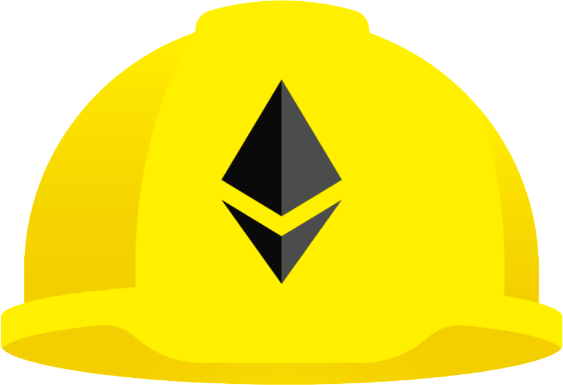

# Hi! :wave:

I'm **TJ** (a.k.a Tanuj).

An Entrepreneur :briefcase:, Developer :computer: and Innovator :test_tube: from India :india:, living in UAE :united_arab_emirates:.

Currently focused on Web3, co-founder of [dappunk](https://dappunk.com) & [TMT Labs](https://tmtlabs.xyz)

## Get in touch
<!-- Website -->

&nbsp;&nbsp;

&nbsp;&nbsp;

 𝕏

 

## Languages
&nbsp;&nbsp;
&nbsp;&nbsp;
&nbsp;&nbsp;
&nbsp;&nbsp;
&nbsp;&nbsp;
&nbsp;&nbsp;
&nbsp;&nbsp;

&nbsp;&nbsp;

 

## Frameworks, Libraries and more
&nbsp;&nbsp;
&nbsp;&nbsp;
&nbsp;&nbsp;

&nbsp;&nbsp;
&nbsp;&nbsp;
&nbsp;&nbsp;

 

## Tools
&nbsp;&nbsp;
&nbsp;&nbsp;
&nbsp;&nbsp;
&nbsp;&nbsp;
&nbsp;&nbsp;
&nbsp;&nbsp;
&nbsp;&nbsp;
&nbsp;&nbsp;
&nbsp;&nbsp;

[website]: https://tanujd.com
[twitter]: https://twitter.com/tanujdamani
[linkedin]: https://linkedin.com/in/tanujdamani
[discord]: https://discordapp.com/users/718076379685453828
